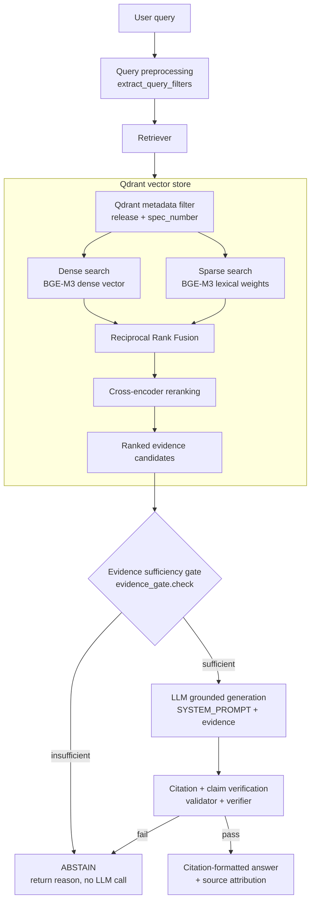
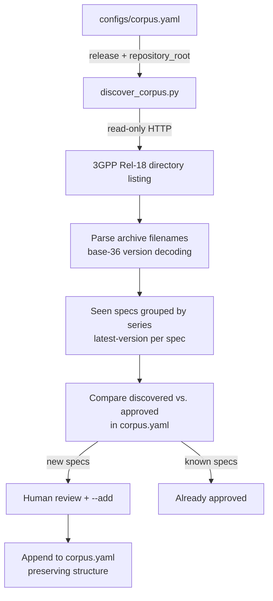
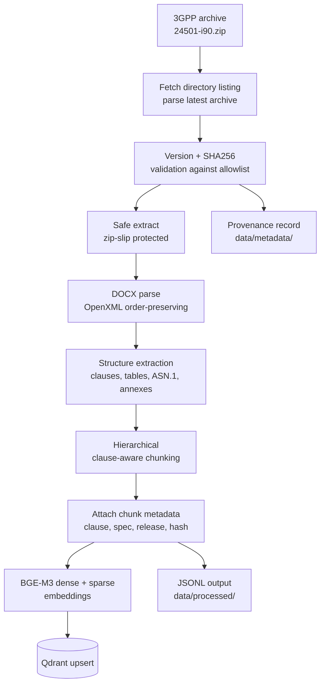
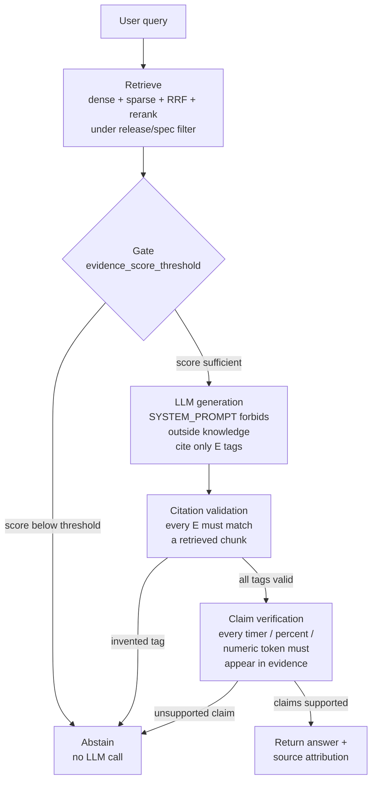

# 3GPP Standards Assistant

A release-controlled, clause-aware Retrieval-Augmented Generation (RAG) system
for official **3GPP Release-18** technical specifications. The system ingests
3GPP standards documents, preserves their native document structure (clauses,
tables, procedures, ASN.1, annexes), and answers natural-language questions by
retrieving grounded evidence from a vector store rather than relying on the
language model's parametric memory.

**The document corpus — not the LLM — is the source of truth.** When the indexed
corpus does not contain sufficient explicit evidence, the system abstains with a
clear explanation rather than producing a plausible-sounding guess.

---

## 1. Overview

### Problem

3GPP specifications (Technical Specifications — TS, and Technical Reports — TR)
are dense, change-controlled technical documents characterized by:

- **Deeply nested clause numbering** (e.g., `5.5.1`, `5.3.2.4`) with cross-
  references that assume the document hierarchy.
- **Exact technical identifiers** (`T3510`, `5QI`, `N2`, `AMF`, `UPF`) whose
  meaning is context-specific and cannot be paraphrased.
- **Normative tables** with merged cells encoding protocol parameters and state
  transitions.
- **ASN.1 definitions** for RRC and NAS message formats.
- **Ordered procedures** (numbered steps) describing signaling flows.
- **Active change control across releases** — a fact valid in Rel-17 may be
  superseded, removed, or renumbered in Rel-18.

A general-purpose LLM chatbot over these documents produces fluent but
unsupported answers: inventing timers, conflating specifications, or answering
from a different release. This system closes that gap with a layered
**evidence-gating → generation → verification** architecture.

### What the system does

For each user query, the system:

1. **Parses** the query for an explicit 3GPP spec number (e.g., `24.501`).
2. **Filters** Qdrant by release and (optionally) spec number *before* any vector
   search — a hard boundary, never a heuristic.
3. **Retrieves** using hybrid dense (BGE-M3) + sparse (BM25-style) search, fused
   via Reciprocal Rank Fusion (RRF), then re-ranked by a cross-encoder.
4. **Gates** on evidence sufficiency — if the top retrieval score is below a
   configurable threshold, the LLM is never called; the system abstains.
5. **Generates** a grounded answer, citing only `[E<n>]` evidence tags.
6. **Verifies** the answer post-generation: every citation tag must map to a
   retrieved chunk, and every numeric/technical identifier in the answer must
   appear in the retrieved evidence.
7. **Returns** either a fully-cited answer with source attributions, or a clean
   abstention with the reason.

### Why hybrid RAG

A single retrieval signal is insufficient for 3GPP content:

- **Dense embeddings** capture semantic intent (e.g., "how does UE registration
  work?") but can blur exact identifiers and conflate specifications that share
  terminology (e.g., NAS `T3510` in 24.501 vs. a similarly-named timer in
  another spec).
- **Sparse (lexical) retrieval** matches exact identifiers, version strings, and
  message names verbatim — but misses semantically-related paraphrases.

BGE-M3 produces both representations from a single model in one forward pass,
avoiding dual-model inconsistency. RRF fuses them cheaply, and the cross-encoder
reranker trades recall for precision on the candidate set before the evidence
gate.

---

## 2. System Architecture



**Key components:**

| Layer | Module | Responsibility |
|---|---|---|
| Query parsing | `app/retrieval/query_preprocessor.py` | Regex-based spec-number extraction (no LLM) |
| Retrieval orchestration | `app/retrieval/retriever.py` | Metadata filter → dense + sparse → RRF → rerank |
| Dense search | `app/retrieval/dense.py` | Qdrant dense vector query under filter |
| Sparse search | `app/retrieval/sparse.py` | Qdrant sparse vector query under filter |
| Fusion | `app/retrieval/hybrid.py` | Reciprocal Rank Fusion (RRF), filter builder |
| Reranking | `app/retrieval/reranker.py` | Cross-encoder re-scoring of fused candidates |
| Vector store | `app/retrieval/qdrant_store.py` | Collection lifecycle, payload indexing, upsert |
| Evidence gating | `app/generation/evidence_gate.py` | Score-threshold sufficiency check (pre-generation) |
| Generation | `app/generation/generator.py` | Orchestrates gate → LLM → verification |
| Prompts | `app/generation/prompts.py` | Grounded system prompt, abstention message |
| LLM | `app/generation/llm.py` | Gemini provider + FakeLLMProvider (test double) |
| Citations | `app/citations/generator.py` | `[E<n>]` tag → full citation string |
| Citation validation | `app/citations/validator.py` | Rejects answers with invented citation tags |
| Claim verification | `app/generation/verifier.py` | Flags unsupported numeric/timer identifiers |
| API | `app/api/routes_chat.py` | `POST /chat` endpoint |
| Configuration | `app/config.py` | `.env` + YAML settings, release-consistency guard |
| Dependency wiring | `app/dependencies.py` | Singleton providers via FastAPI `Depends` |

---

## 3. Design Decisions

### Technology selection

| Decision | Rationale |
|---|---|
| **Qdrant** | Native support for *both* dense and sparse vectors in a single collection, with payload filtering — exactly matching the hybrid + metadata-filter design. A single collection holding both vectors and the full `Chunk` payload avoids juggling two separate stores. |
| **BGE-M3** (`BAAI/bge-m3`) | One model produces both the dense vector (1024-dim) and the lexical sparse representation in a single forward pass. This eliminates inter-model embedding inconsistency and simplifies the hybrid pipeline. |
| **Hybrid dense + sparse** | Dense captures semantic intent; sparse captures exact identifiers (`T3510`, `5QI`, `N2`, `PDU session establishment`). RRF combines them cheaply without requiring server-side fusion APIs. |
| **Cross-encoder reranker** (`cross-encoder/ms-marco-MiniLM-L-6-v2`) | Re-scores the small candidate set (8 chunks by default) with full query×chunk attention after fusion. Improves precision at low cost since the candidate width is already constrained. |
| **RRF implementation (Python, k=60)** | Implemented directly rather than relying on Qdrant's server-side fusion, keeping behavior stable across Qdrant versions and trivially unit-testable. The conventional `k=60` constant is used. |
| **Reciprocal Rank Fusion over BM25 score averaging** | RRF is rank-based and inherently robust to the different score scales of dense vs. sparse retrieval. It also handles cases where a chunk is missing from one list's top-k. |
| **FastAPI backend** | Clean, Pydantic-validated REST surface with dependency injection (`Depends`) that makes the singleton wiring (`get_retriever`, `get_generator`) trivially swappable for test fakes. |
| **Streamlit frontend** | Low-overhead chat UI with no custom JavaScript required; talks to the backend over HTTP, keeping all retrieval/generation logic server-side. |
| **Redis-free, single-process design** | No distributed state beyond Qdrant itself; `lru_cache` on dependency providers makes the embedding model, reranker, and LLM client process-wide singletons. |

### Release and specification isolation

The single most safety-critical design constraint is that **a Rel-18 query must
never retrieve Rel-17 content**, and a query about `24.501` must never retrieve
`23.501` chunks. This is enforced at *three* levels:

1. **Configuration guard** — `app/config.py` raises `ValueError` at startup if
   the env-level `TARGET_RELEASE` does not match `configs/corpus.yaml`'s
   declared release. Cross-release contamination is rejected before the process
   starts.
2. **Qdrant payload filter** — `build_release_spec_filter()` applies a `release`
   match-condition to *every* query. The optional `spec_number` condition is
   added on top. This filter is applied *before* vector search, so neither dense
   nor sparse vectors consider out-of-scope points.
3. **Test coverage** — `tests/test_retrieval.py` verifies both that spec-number
   filtering isolates to the correct document and that release filtering never
   leaks cross-release content.

### Corpus allowlist and automatic discovery

The system ingests only what `configs/corpus.yaml` authorizes. This file is a
**release-scoped allowlist** — it is not a manually-populated inventory of every
3GPP document that exists. Instead, it is generated and validated by
`scripts/discover_corpus.py`, which queries the official 3GPP repository
directory and cross-checks candidates against the allowlist.

**Discovery workflow:**



`discover_corpus.py` is **read-only**: it never fetches, downloads, or indexes
documents. It queries the official 3GPP Rel-18 series directories
(`configs/corpus.yaml`'s `sources.repository_root`), parses archive filenames
(which encode spec number and version using a base-36 release-letter scheme),
groups them by series and spec, and selects the highest-versioned archive per
spec. It then compares the discovered set against the `documents` entries
already approved in `corpus.yaml`.

Specifications found in the official directory but not yet in the allowlist are
reported as candidates for human review. A spec is only promoted to approved
status through an explicit `--add` invocation, which requires both verification
against the discovered set and an explicit title — titles are never invented.
The script performs targeted text insertion so existing structure, ordering, and
comments in `corpus.yaml` are preserved.

This separation ensures the allowlist remains the **sole source of truth** for
what the downloader and ingestion pipeline may process. The release-isolation
guarantee is preserved end-to-end: discovery validates the requested release
against `corpus.yaml` and only considers archives whose release-letter code
matches (Rel-18 = `i`, so `24501-i90.zip`).

---

## 4. Corpus

The current allowlist (`configs/corpus.yaml`) contains these Release-18
specifications:

| Spec | Series | Title |
|---|---|---|
| 23.501 | 23 | System architecture for the 5G System (5GS) |
| 23.502 | 23 | Procedures for the 5G System (5GS) |
| 24.501 | 24 | Non-Access-Stratum (NAS) protocol for 5G System (5GS) |
| 33.501 | 33 | Security architecture and procedures for 5G System |
| 29.244 | 29 | Interface between the Control Plane and the User Plane nodes |
| 29.500 | 29 | 5G System; Technical Realization of Service Based Architecture |
| 38.300 | 38 | NR and NG-RAN Overall Description |
| 38.331 | 38 | NR Radio Resource Control (RRC) protocol specification |

All documents are Release-18. The `release` and `release_number` fields in
`corpus.yaml` are frozen; changing them requires a deliberate update to both
this file and the `TARGET_RELEASE` environment variable.

---

## 5. Ingestion Pipeline

The ingestion pipeline transforms official 3GPP DOCX/ZIP archives into
searchable chunks in Qdrant. It is a one-time batch job (with optional
re-ingestion for updates), not part of the request path.



### Pipeline stages

| Stage | Module | Description |
|---|---|---|
| **Directory listing** | `ingestion/downloader.py` | Fetches the 3GPP series directory HTML and parses archive filenames. Retries on transient network errors. |
| **Archive resolution** | `ingestion/downloader.py` | `find_latest_archive` selects the highest-versioned archive matching the spec + release letter. Never falls back across releases. |
| **Download** | `ingestion/downloader.py` | Streams the archive to a `.part` file, renames on success. Atomic against partial downloads. |
| **Validation** | `ingestion/validator.py` | Single choke point: checks spec digits, release letter, file existence, and computes SHA-256. Mismatch = hard stop (never "index with warning"). |
| **Extraction** | `ingestion/archive.py` | `safe_extract` rejects any ZIP entry whose path escapes the destination (zip-slip defense). |
| **DOCX parsing** | `ingestion/docx_parser.py` | Walks OpenXML body directly to preserve true paragraph/table interleaving order (python-docx's `.paragraphs`/`.tables` lose order). Extracts table merge geometry (`gridSpan`, `vMerge`). |
| **DOC→DOCX** (if needed) | `ingestion/doc_converter.py` | Headless LibreOffice conversion for legacy `.doc` archives (some specs ship .doc). |
| **Structure extraction** | `ingestion/structure_parser.py` | Detects clause headings (style + numbering + regex cross-validated), annexes, procedures, notes, figures, and tables. Groups consecutive ASN.1 paragraphs into atomic blocks. |
| **ASN.1 detection** | `ingestion/asn1_parser.py` | Style-based ("TT"/code) + lexical signal (`::=`, `SEQUENCE`, `CHOICE`, etc.). |
| **Table normalization** | `ingestion/table_parser.py` | Resolves merged cells: vertical merges are filled forward (inherited text), horizontal spans preserved via `colspan`. Renders as GitHub-flavored Markdown. |
| **Chunking** | `ingestion/chunker.py` | Clause-aware greedy packing (target 800 tokens max, 80-token overlap). Tables and ASN.1 are isolated as atomic chunks. Multi-block clauses get a synthetic PARENT chunk. |
| **Embedding** | `app/retrieeval/embeddings.py` | BGE-M3 produces dense (1024-dim) + sparse vectors in one pass. |
| **Upsert** | `app/retrieval/qdrant_store.py` | Embeds, assigns deterministic UUID5 point IDs (idempotent), skips unchanged chunks (content-hash check), upserts with both vectors + full payload. |

### Chunk model

Each chunk (`app/models/schema.py`) carries the metadata needed for filtering,
citations, and provenance:

- **Identity**: `chunk_id` (globally unique), `content_hash` (`sha256:` of text)
- **Document identity**: `spec_number`, `document_type`, `series`, `release`,
  `release_number`, `version`, `title`
- **Structural location**: `clause_number`, `clause_title`, `clause_path` (full
  ancestry root-first), `parent_clause`, `parent_title`, `parent_chunk_id`
  (for child chunks referencing a synthetic PARENT block)
- **Content**: `content_type` (paragraph, heading, procedure, table, asn1,
  figure, annex, note), `text`, `table_data` (structured, for TABLE chunks),
  `token_count`, `chunk_index`
- **Flags**: `is_normative`, `is_annex`, `is_table`, `is_figure`, `is_asn1`
  (indexed as Qdrant payload fields for fast filtering)
- **Provenance**: `source_file`, `source_url`, `source_locator` (human-readable
  citation string)

### CLI entry points

| Script | Purpose |
|---|---|
| `scripts/download.py` | Full pipeline for one or more specs (download → validate → extract → parse → chunk → JSONL). `--all` processes the entire allowlist. |
| `scripts/preprocess.py` | Parse an already-present local DOCX into JSONL (useful for testing the parser against real samples without network). |
| `scripts/build_jsonl.py` | Validate every `data/processed/*.jsonl` file by re-parsing through the `Chunk` pydantic model; reports corpus stats. |
| `scripts/ingest_qdrant.py` | Embed all processed JSONL files with BGE-M3 and upsert into Qdrant. |
| `scripts/discover_corpus.py` | Inspect the official 3GPP directory for new/approved specs. Read-only: never downloads or indexes. `--add` promotes verified candidates to the allowlist. |

---

## 6. Setup

Requires Python 3.11+ (developed and tested on 3.12).

### 1. Install dependencies

```bash
git clone <this repository>
cd 3GPP-Standards-Assistant
python3 -m venv .venv
source .venv/bin/activate        # Windows: .venv\Scripts\activate
pip install -r requirements.txt
```

`requirements.txt` includes torch-based packages (`FlagEmbedding` for BGE-M3,
`sentence-transformers` for the reranker). These are large installs; if you
only want to run parsing/pipeline validation without embeddings, you can
install the lighter subset first.

### 2. Configure environment

```bash
cp .env.example .env
```

Edit `.env` and set at minimum `GEMINI_API_KEY` before running the chat
pipeline. Key variables:

| Variable | Default | Purpose |
|---|---|---|
| `GEMINI_API_KEY` | — | LLM provider key (never commit a real value) |
| `QDRANT_URL` | `http://localhost:6333` | Qdrant endpoint (local or Cloud) |
| `QDRANT_COLLECTION` | `3gpp_standards` | Vector collection name |
| `EMBEDDING_MODEL` | `BAAI/bge-m3` | Dense + sparse embedding model |
| `RERANKER_MODEL` | `cross-encoder/ms-marco-MiniLM-L-6-v2` | Re-ranking cross-encoder |
| `EMBEDDING_BATCH_SIZE` | `16` | Chunks per embedding forward pass |
| `TARGET_RELEASE` | `Rel-18` | **Must** match `configs/corpus.yaml` release |
| `DENSE_TOP_K` | `20` | Dense retrieval candidate count |
| `SPARSE_TOP_K` | `20` | Sparse retrieval candidate count |
| `RERANK_TOP_K` | `8` | Final candidate count after re-ranking |
| `EVIDENCE_SCORE_THRESHOLD` | `0.35` | Evidence gate cutoff (calibrate before production) |

### 3. Start Qdrant

A running Qdrant instance is required. The simplest local option:

```bash
docker run -p 6333:6333 -p 6334:6334 -v qdrant_data:/qdrant/storage qdrant/qdrant:v1.12.4
```

### 4. Prepare the corpus

```bash
# Full pipeline (download → validate → parse → chunk → JSONL) for every
# allowlisted Rel-18 document:
python scripts/download.py --all

# Or just one spec:
python scripts/download.py 23.501

# Or parse a locally-downloaded DOCX (no network):
python scripts/preprocess.py path/to/24501-i90.docx \
  --spec 24.501 --series 24 --version 18.9.0 \
  --title "Non-Access-Stratum (NAS) protocol for 5G System (5GS)"

# Validate the JSONL corpus and print stats:
python scripts/build_jsonl.py
```

> **Before adding new specs to the corpus**, inspect the official directory for
> candidates without modifying anything:
>
> ```bash
> python scripts/discover_corpus.py --missing       # show specs in the 3GPP
>                                                  # directory not yet in corpus.yaml
> ```

### 5. Ingest into Qdrant

```bash
python scripts/ingest_qdrant.py            # all processed JSONL files
python scripts/ingest_qdrant.py --spec 24.501   # just one
```

BGE-M3 model weights are downloaded from HuggingFace Hub on first run (requires
network access). Compute is auto-selected: **CUDA GPU** when available,
otherwise **CPU**.

### 6. Start the API and UI

```bash
# API
uvicorn app.main:app --host 0.0.0.0 --port 8000

# Frontend (in a separate terminal)
API_BASE_URL=http://localhost:8000 streamlit run frontend/streamlit_app.py
```

API: `http://localhost:8000` &nbsp;|&nbsp; UI: `http://localhost:8501`

### API endpoints

| Method | Endpoint | Description |
|---|---|---|
| `POST` | `/chat` | Retrieve + generate a grounded answer (the main entry point) |
| `POST` | `/search` | Transparent retrieval debugging (bypasses evidence gate + LLM) |
| `GET` | `/metadata/documents` | List the corpus allowlist for the frontend's document selector |
| `GET` | `/health` | Liveness check (Qdrant reachable + collection exists) |

---

## 7. Hallucination Mitigation

The system applies four layers of defense against unsupported answers. The
ordering matters — each layer filters out a different failure class before the
next expensive step.



**Layer 1 — Metadata filtering (before retrieval):** The Qdrant payload filter
on `release` and `spec_number` ensures retrieval only considers points from the
scoped specification and release. Out-of-scope content is structurally excluded.

**Layer 2 — Evidence sufficiency gate (before generation):** If the top retrieval
score is below `EVIDENCE_SCORE_THRESHOLD` (default `0.35`), the LLM is never
called. The gate is a pre-generation check — it answers "is there enough
evidence?" without attempting to answer the question itself. An optional
LLM-based secondary sufficiency check (`llm_sufficiency_check`) is provided for
cases where a score threshold alone is too blunt.

**Layer 3 — Grounded generation prompt:** The `SYSTEM_PROMPT` (in
`app/generation/prompts.py`) explicitly forbids outside knowledge, model memory,
assumptions, unstated implications, and unsupported technical inference. It
instructs the model to cite every claim using the bracketed `[E<n>]` tags
provided in the evidence block, and to respond with the exact abstention message
when evidence is insufficient. Temperature is set to `0.1` (low) in the Gemini
provider to minimize stochastic drift.

**Layer 4 — Post-generation verification:** After the LLM produces an answer:

- **Citation validation** (`app/citations/validator.py`): Every `[E<n>]` tag in
  the answer is checked against the list of actually-retrieved citations. Any tag
  numbering a chunk that was not supplied is treated as an invented reference —
  the answer is rejected and replaced with abstention.
- **Claim verification** (`app/generation/verifier.py`): Numeric tokens (timers
  like `T3510`, percentages, and 2+ digit bare numbers) in the answer that do not
  appear verbatim in the retrieved evidence text are flagged as unsupported
  invention. The answer is rejected if any are found. (Single-digit numbers like
  "5G" are excluded to avoid false positives.)

**Abstention** is treated as a normal, successful outcome at every layer — not
an error path. When the pipeline cannot ground an answer in retrieved evidence,
it returns a clean abstention message with the specific reason, and the UI
surfaces that reason to the user.

---

## 8. Query Processing

Query preprocessing is intentionally rule-based (regex), not an LLM call. It
must be fast, deterministic, and dependency-free so it runs on every `/chat`
and `/search` request without latency or cost.

The pattern `\b(?:TS\s*?)?(\d{2}\.\d{2,3})\b(?!\.\d)` extracts 3GPP spec numbers
such as `24.501`, `23.502`, or `38.331` from free-text queries (e.g., "What is
timer T3510 in TS 24.501?").

| Signal | Handling |
|---|---|
| `TS 24.501`, `TS24.501`, `3GPP TS 24.501` | Prefix is optional; core number extracted |
| `18.9.0` (release.version) | Excluded by negative lookahead `(?!\.\d)` (three dot-groups) |
| `5.5.1` (clause number) | Excluded by leading `\d{2}` requirement (single digit) |

The extracted `spec_number`, when present, is passed to the retriever and applied
as a Qdrant payload filter **before** the vector search — this scopes retrieval
to the specific document the user is asking about, dramatically improving
precision over searching the whole corpus.

The `release` filter is **always** applied and is never overridden by
query-derived inference. Release control is a hard safety boundary, not a
heuristic.

---

## 9. Evaluation

The repository includes evaluation harnesses that measure both retrieval quality
and generation safety. These scripts require a populated Qdrant collection and
network access to the 3GPP repository, HuggingFace, and the Gemini API.

### Benchmark dataset

`evaluation/dataset.json` contains **22 curated questions** organized by category:

| Category | Count | Description |
|---|---|---|
| Architecture | 3 | System-level "what is the role of X" questions |
| Procedures | 2 | Multi-step procedure descriptions |
| NAS | 2 | Spec-specific identifier questions (e.g., T3510) |
| RAN | 2 | 38.331 RRC message content |
| Security | 2 | 33.501 authentication and key hierarchy |
| Exact identifier | 2 | Precise values/timers |
| Tables | 2 | Table-derived content (5QI values, 5GMM cause values) |
| Cross-document | 2 | Relations across specs |
| Unanswerable | 3 | Out-of-scope (internal budget, author names, silicon specs) |
| Wrong release | 2 | Rel-17 or Rel-15 questions against a Rel-18 corpus |

Every question carries an `answerable` boolean and, for answerable questions, an
`expected_spec` and optional `expected_clause_prefix`.

### Evaluation scripts

| Script | Metrics | Description |
|---|---|---|
| `evaluation/evaluate_retrieval.py` | `recall_at_5/10/20`, `context_precision_at_5` | Runs each answerable question through the retriever directly (bypassing LLM); checks whether a retrieved chunk matches the `expected_spec` (and clause prefix). |
| `evaluation/evaluate_generation.py` | `correct_abstentions`, `false_answer_rate`, `unnecessary_abstention_rate`, `citation_accuracy`, `hallucination_rate` | Runs the full grounded-generation pipeline for every question; scores outcomes against `answerable` labels. |
| `evaluation/ablation.py` | `recall_at_10` | Three experiments: A) dense-only, B) dense+sparse (RRF), C) dense+sparse+reranker. |
| `evaluation/ragas_eval.py` | `faithfulness`, `context_precision`, `context_recall` | LLM-judge metrics via ragas + Gemini. Reference answers are generated by a separate Gemini judge and cached. `--fake` mode dumps the assembled dataset without network. |

### Running evaluation

```bash
python evaluation/evaluate_retrieval.py    # recall@k, context precision
python evaluation/evaluate_generation.py   # citation accuracy, abstention rates
python evaluation/ablation.py              # dense vs. +sparse vs. +reranker
python evaluation/ragas_eval.py --fake     # assemble ragas dataset (no network)
python evaluation/ragas_eval.py           # real Gemini judge (requires GEMINI_API_KEY)
```

**Important caveat:** The evaluation harnesses are implemented and importable,
but have **not** been run against a live corpus in this environment. Measuring
real retrieval/generation metrics requires outbound access to the 3GPP
repository, HuggingFace (for BGE-M3 weights), and the Gemini API. No numerical
metric values are reported until a live run is performed. The `EVIDENCE_SCORE_THRESHOLD`
(default `0.35`) is a starting value that must be calibrated against real data.

---

## 10. Testing

The test suite (`tests/`) uses synthetic fixtures and test doubles
(`FakeEmbeddingProvider`, `FakeReranker`, `FakeLLMProvider`) with an in-memory
Qdrant instance — no real models or network access required.

| Test file | Test | What it verifies |
|---|---|---|
| `tests/test_query_preprocessor.py` | `test_extracts_spec_number_from_query` | `extract_query_filters("What is timer T3510 in TS 24.501?")` returns `spec_number="24.501"` |
| `tests/test_retrieval.py` | `test_metadata_filter_isolates_spec_number` | Qdrant payload filter scopes dense retrieval to one spec number |
| `tests/test_retrieval.py` | `test_retriever_release_never_overridden_by_query` | A query naming a spec does not leak content from another release |
| `tests/test_generator.py` | `test_abstains_when_evidence_gate_fails` | Below-threshold evidence causes the generator to abstain without calling the LLM |
| `tests/test_api.py` | `test_chat_endpoint_returns_grounded_answer` | End-to-end `/chat`: retrieval → evidence gate → LLM → citations → source attribution |

Run the suite:

```bash
python -m pytest tests/ -v
```

---

## 11. Limitations

- **No live evaluation on real 3GPP data.** BGE-M3 weights, the Gemini API,
  and the 3GPP repository are not reachable from this development environment.
  Retrieval/generation metrics and the `EVIDENCE_SCORE_THRESHOLD` have not been
  calibrated against real documents. The test suite uses synthetic fixtures and
  fake providers.
- **Frozen to Rel-18.** The corpus allowlist and `TARGET_RELEASE` are pinned to
  Release 18; multi-release support would require schema and validation changes.
- **Evaluation dataset size.** `evaluation/dataset.json` has 22 questions;
  100–150 questions are recommended for statistically meaningful thresholds and
  ablation comparisons.
- **Figure handling.** Figures are detected by caption pattern
  (`Figure X.Y: ...`) and flagged, not extracted as image objects. The system
  deliberately avoids answering from unparsed diagrams.
- **ASN.1 detection is heuristic** (paragraph style + lexical signal) and may
  need tuning for unusually formatted real documents.
- **Chunk sizing fallback.** If `tiktoken` cannot fetch its vocabulary (no
  network), the chunker falls back to a character-count approximation for
  sizing only; chunk *content* and all grounding guarantees are unaffected.
- **Cross-document questions.** The ablation and retrieval evaluation treat
  cross-document queries as scoped to the `expected_spec` only; richer
  multi-document synthesis is out of MVP scope.

---

## 12. Project Structure

```text
3GPP Standards Assistant/
├── app/
│   ├── main.py                  # FastAPI app + route wiring
│   ├── dependencies.py          # Singleton wiring (retriever, generator, embedder, reranker, LLM)
│   ├── config.py                # .env + configs/*.yaml, release-consistency guard
│   ├── logging_config.py        # Structured loguru configuration
│   ├── api/
│   │   ├── routes_chat.py       # POST /chat — retrieval + grounded generation
│   │   ├── routes_search.py     # POST /search — transparent retrieval debugging
│   │   ├── routes_metadata.py   # GET /metadata/documents — corpus allowlist
│   │   ├── routes_health.py     # GET /health — liveness check
│   │   └── schemas.py           # Pydantic request/response models
│   ├── models/
│   │   └── schema.py            # Chunk / TableData / TableCell / SourceDocument models
│   ├── retrieval/
│   │   ├── device.py            # CUDA/CPU auto-selection
│   │   ├── embeddings.py        # BGE-M3 dense + sparse provider
│   │   ├── qdrant_store.py      # Collection lifecycle, payload indexing, upsert
│   │   ├── dense.py             # Dense vector search
│   │   ├── sparse.py            # Sparse vector search
│   │   ├── hybrid.py            # RRF fusion + metadata filter builder
│   │   ├── reranker.py          # Cross-encoder reranker
│   │   ├── query_preprocessor.py# Regex-based spec-number extraction
│   │   └── retriever.py         # Orchestrates filter → dense+sparse → RRF → rerank
│   ├── generation/
│   │   ├── prompts.py           # Grounded system prompt + abstention message
│   │   ├── llm.py               # Gemini LLM provider + fake (test double)
│   │   ├── evidence_gate.py     # Pre-generation evidence sufficiency threshold
│   │   ├── verifier.py          # Post-generation claim verification
│   │   └── generator.py         # Grounded generation orchestrator
│   └── citations/
│       ├── generator.py         # [E<n>] tag → citation mapping
│       └── validator.py         # Citation tag validation
├── ingestion/
│   ├── downloader.py            # Resolve + download latest archive (3GPP filename conventions)
│   ├── validator.py             # Filename/version/SHA256/allowlist validation
│   ├── archive.py               # Safe ZIP extraction (zip-slip protected)
│   ├── doc_converter.py         # Legacy DOC → DOCX via LibreOffice
│   ├── docx_parser.py           # OpenXML order-preserving DOCX parser
│   ├── structure_parser.py      # Clause/table/procedure/ASN.1/annex detection
│   ├── table_parser.py          # Merged-cell table normalization
│   ├── asn1_parser.py           # ASN.1 block detection
│   ├── chunker.py               # Hierarchical clause-aware chunking
│   └── pipeline.py              # download → validate → extract → parse → chunk → JSONL
├── configs/
│   ├── corpus.yaml              # Rel-18 document allowlist (frozen for MVP)
│   └── settings.yaml            # Chunking defaults
├── scripts/
│   ├── download.py              # Download + ingest one/many/all specs
│   ├── preprocess.py            # Parse a local DOCX into JSONL
│   ├── build_jsonl.py           # Validate JSONL corpus + print stats
│   ├── ingest_qdrant.py         # Embed + upsert into Qdrant
│   └── discover_corpus.py       # Inspect 3GPP directory for new/approved specs
├── evaluation/
│   ├── dataset.json             # 22 benchmark questions
│   ├── evaluate_retrieval.py    # Recall@k, context precision
│   ├── evaluate_generation.py   # Citation accuracy, abstention rates, hallucination proxy
│   ├── ablation.py              # Dense vs. +sparse vs. +reranker
│   ├── ragas_eval.py            # LLM-judge metrics (faithfulness, context precision/recall)
│   └── results/                 # Evaluation output
├── frontend/
│   └── streamlit_app.py         # Chat UI
├── tests/                       # Unit tests (synthetic fixtures, in-memory Qdrant)
├── requirements.txt
└── .env.example
```

---

## 13. License

This project indexes publicly available 3GPP specifications for research and
internal reference. The 3GPP content itself remains the property of 3GPP and
its contributing partners; this tool provides a search and query interface over
that content, not a redistribution of it.
