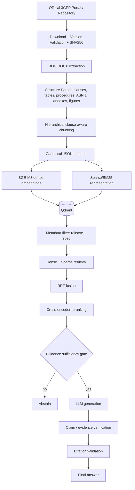

# 3GPP Standards RAG Chatbot

A release-controlled, clause-aware RAG system for official 3GPP Release-18
technical specifications. It preserves native document structure (clauses,
tables, procedures, ASN.1, annexes), combines dense + sparse retrieval,
reranks evidence, validates grounding and citations, and **abstains** when
the indexed corpus does not provide sufficient evidence.

> **The document corpus, not the LLM, is the source of truth.**

## Why 3GPP is hard for RAG

3GPP specifications combine deeply nested clause numbering, exact technical
identifiers (`T3510`, `5QI`, `N2`), normative tables with merged cells,
ordered procedures, ASN.1 definitions, and cross-references — all under
active change control across releases. A generic RAG pipeline over PDFs
tends to flatten this structure and lets the LLM fill gaps with
plausible-sounding but unsupported detail. This project is built around
evidence grounding and abstention rather than fluent generation.

## Architecture



## Project structure

```text
3gpp-rag-chatbot/
├── app/
│   ├── main.py                  # FastAPI app
│   ├── dependencies.py          # Singleton wiring (Qdrant client, embedder, reranker, LLM)
│   ├── config.py                # .env + configs/*.yaml, with release-consistency guard
│   ├── logging_config.py
│   ├── api/                     # routes_chat.py, routes_search.py, routes_health.py, schemas.py
│   ├── models/schema.py         # Canonical Chunk / TableData / SourceDocument models
│   ├── retrieval/                # embeddings, qdrant_store, dense, sparse, hybrid (RRF), reranker, retriever
│   ├── generation/                # prompts, llm, evidence_gate, verifier, generator
│   └── citations/                 # generator, validator
├── ingestion/
│   ├── downloader.py, validator.py, archive.py, doc_converter.py
│   ├── docx_parser.py, table_parser.py, asn1_parser.py, structure_parser.py
│   ├── chunker.py, pipeline.py
├── configs/
│   ├── corpus.yaml               # Rel-18 document allowlist (frozen for MVP)
│   └── settings.yaml             # Chunking defaults
├── scripts/                       # download.py, preprocess.py, build_jsonl.py, ingest_qdrant.py, discover_corpus.py
├── evaluation/                    # dataset.json, evaluate_retrieval.py, evaluate_generation.py, ablation.py, ragas_eval.py
├── frontend/streamlit_app.py
├── tests/                         # 165 tests, synthetic fixtures only
├── Dockerfile, docker-compose.yml
├── requirements.txt, .env.example
```

## Installation

Requires Python 3.11+ (developed/tested on 3.12).

```bash
git clone <this repo>
cd 3gpp-rag-chatbot
python3 -m venv .venv
source .venv/bin/activate        # Windows: .venv\Scripts\activate
pip install -r requirements.txt
cp .env.example .env
```

Edit `.env` and set at minimum `GEMINI_API_KEY` before running the chat
pipeline. `requirements.txt` includes torch-based packages (`FlagEmbedding`
for BGE-M3, `sentence-transformers` for the reranker) — these are large
installs; if you only want to run ingestion/parsing without embeddings, you
can skip them initially.

## Environment variables

See `.env.example` for the full list. Key ones:

| Variable | Purpose |
|---|---|
| `GEMINI_API_KEY` | LLM provider key (never commit a real value) |
| `LLM_MODEL` | Default `gemini-2.0-flash` |
| `QDRANT_URL` / `QDRANT_API_KEY` | Local (`http://localhost:6333`) or Qdrant Cloud |
| `TARGET_RELEASE` | Must match `configs/corpus.yaml`'s `release` — mismatch fails fast at startup |
| `DENSE_TOP_K`, `SPARSE_TOP_K`, `FUSED_TOP_K`, `RERANK_TOP_K` | Retrieval pipeline width at each stage |
| `EMBEDDING_BATCH_SIZE` | Chunks embedded per forward pass during ingestion (default `16`). Larger = faster on GPU but uses more VRAM; raise it on your RTX 1650 (e.g. `32`–`64`) if VRAM allows |
| `EVIDENCE_SCORE_THRESHOLD` | **Starting value only** — must be calibrated against `evaluation/dataset.json` results before treating as production-ready (SRD §30) |

## End-to-end usage

### 1. Start Qdrant

```bash
docker run -p 6333:6333 -p 6334:6334 -v qdrant_data:/qdrant/storage qdrant/qdrant:v1.12.4
```

### 2. Download and ingest 3GPP documents

```bash
# Full pipeline (download -> validate -> parse -> chunk -> JSONL) for one spec:
python scripts/download.py 23.501

# Or every allowlisted document (SRD Phase 5 corpus expansion):
python scripts/download.py --all

# If you already have a DOCX file locally (e.g. downloaded by hand):
python scripts/preprocess.py path/to/24501-i90.docx \
    --spec 24.501 --series 24 --version 18.9.0 \
    --title "Non-Access-Stratum (NAS) protocol for 5G System (5GS)"

# Validate the resulting JSONL corpus and see stats:
python scripts/build_jsonl.py
```

### 3. Generate embeddings and ingest into Qdrant

```bash
python scripts/ingest_qdrant.py            # all processed JSONL files
python scripts/ingest_qdrant.py --spec 24.501   # just one
```

This step downloads the BGE-M3 model weights from HuggingFace Hub on first
run (requires network access to `huggingface.co`) and then embeds every
chunk locally. Compute is auto-selected at runtime: **CUDA GPU** when a
usable NVIDIA GPU is available (e.g. an RTX 1650), otherwise **CPU** —
no manual configuration needed. The same auto-selection applies to the
cross-encoder reranker loaded by the API.

### 4. Run the API

```bash
uvicorn app.main:app --host 0.0.0.0 --port 8000
```

### 5. Run the frontend

```bash
API_BASE_URL=http://localhost:8000 streamlit run frontend/streamlit_app.py
```

### 6. Run evaluation

```bash
python evaluation/evaluate_retrieval.py   # Recall@5/10/20, Context Precision@5
python evaluation/evaluate_generation.py  # citation accuracy, abstention accuracy, hallucination rate
python evaluation/ablation.py             # dense-only vs +sparse vs +reranker (Recall@10)
```

### All-in-one with Docker Compose

```bash
docker compose up --build
# API:       http://localhost:8000
# Streamlit: http://localhost:8501
# Qdrant:    http://localhost:6333
```

Ingestion still needs to be run explicitly (it's a one-time/periodic batch
job, not something the API container does on startup):

```bash
docker compose run api python scripts/download.py --all
docker compose run api python scripts/ingest_qdrant.py
```

## Example queries

```bash
curl -X POST http://localhost:8000/chat \
  -H "Content-Type: application/json" \
  -d '{"query": "What is T3510 and when is it started?", "release": "Rel-18"}'
```

```json
{
  "answer": "T3510 is started when the UE sends a REGISTRATION REQUEST message [E1]...",
  "abstained": false,
  "confidence": 0.87,
  "sources": [
    {"spec_number": "24.501", "release": "Rel-18", "version": "18.9.0", "clause": "5.5.1", "source_locator": "TS 24.501 v18.9.0, Clause 5.5.1"}
  ]
}
```

A question the corpus can't support returns:

```json
{
  "answer": "I don't have sufficient evidence in the indexed 3GPP standards corpus to answer this question.",
  "abstained": true,
  "confidence": 0.0,
  "sources": [],
  "abstain_reason": "Top retrieval score 0.0210 below threshold 0.3500"
}
```

Debug retrieval directly (bypasses the LLM and evidence gate):

```bash
curl -X POST http://localhost:8000/search \
  -H "Content-Type: application/json" \
  -d '{"query": "PDU session establishment", "release": "Rel-18", "top_k": 5}'
```

## Hallucination-control architecture

Every `/chat` request passes through, in order:

1. **Metadata-filtered hybrid retrieval** (`app/retrieval/retriever.py`) — dense (BGE-M3) + sparse search, both scoped to `release` (and optionally `spec_number`) via a Qdrant payload filter *before* vector search, then fused with Reciprocal Rank Fusion.
2. **Cross-encoder reranking** (`app/retrieval/reranker.py`) — re-scores the fused candidate set for precision.
3. **Evidence sufficiency gate** (`app/generation/evidence_gate.py`) — a configurable score threshold; below it, the system abstains without ever calling the LLM.
4. **Grounded generation** (`app/generation/llm.py`, `prompts.py`) — the system prompt forbids outside knowledge and requires every claim to cite a supplied `[E<n>]` evidence tag.
5. **Citation validation** (`app/citations/validator.py`) — any `[E<n>]` tag the model outputs that doesn't correspond to actually-retrieved evidence causes the whole answer to be rejected and replaced with abstention.
6. **Claim verification** (`app/generation/verifier.py`) — flags timers/percentages/numeric tokens in the answer that don't appear anywhere in the retrieved evidence text; a hard failure here also triggers abstention.

Abstention is a normal, successful outcome at every stage — never an error
path. The full orchestration lives in `app/generation/generator.py`
(`GroundedGenerator.answer()`).

## What's verified vs. not

**Fully implemented and tested (165/165 tests, synthetic fixtures):**
version validation and release-letter isolation, zip-slip-safe extraction,
document-order DOCX parsing, merged-cell table normalization, ASN.1 block
detection, clause hierarchy extraction, hierarchical/adaptive chunking with
parent-child linkage, JSONL round-tripping, Qdrant collection lifecycle and
upsert (against an in-memory Qdrant instance), metadata-filtered dense and
sparse search, RRF fusion, reranking, the evidence gate, citation
generation/validation, claim verification, the full grounded-generation
orchestrator, and every FastAPI route — all exercised with deterministic
fake embedding/reranker/LLM providers so no external service or model
download is required to run the suite.

**Implemented but not executable in this development environment** (no
outbound access to `3gpp.org`, `huggingface.co`, or the Gemini API from
here):
- A live run of `scripts/download.py` against the real 3GPP repository. The downloader is written against 3GPP's documented archive-naming convention (verified against the SRD's own examples, e.g. `24501-i90.docx` for Rel-18 v18.9.0) but has not fetched a real file end-to-end.
- Parsing a real 3GPP DOCX file. The parser/chunker are tested against a synthetic fixture (`tests/docx_fixtures.py`) that exercises the same structural features (headings, merged-cell tables, ASN.1-styled paragraphs, annexes) — if you provide a real file via `scripts/preprocess.py`, it should work, but hasn't been confirmed against 3GPP's actual template quirks.
- Real BGE-M3 embeddings and real cross-encoder reranking — `FlagEmbedding`/`sentence-transformers` model weights require a HuggingFace download not available here; both are implemented as production classes (`BGEM3EmbeddingProvider`, `CrossEncoderReranker`) with lazy imports, and tested via interface-compatible fakes.
- A real Gemini API call — `GeminiProvider` is implemented against the current `google-genai` SDK (the older `google-generativeai` package is deprecated upstream as of this writing) but has not been called with a real key.
- `pip install -r requirements.txt` for the heavy packages (torch-based) has not been run in full here, to avoid a very long install in this environment — the lighter dependencies (`python-docx`, `qdrant-client`, `fastapi`, etc.) were installed and used for all 165 tests.

**One deliberate SRD deviation:** `tiktoken`'s BPE vocab file is fetched
from `openaipublic.blob.core.windows.net` on first use, which this
environment can't reach. `ingestion/chunker.py` now tries the real
tokenizer once and falls back to a `len(text)//4` character-count
approximation if that fetch fails — this only affects the precision of
chunk *sizing* (target 500-800 tokens), never chunk *content* or any
grounding/citation guarantee. In a networked environment, real tiktoken
counts are used automatically.

## Limitations

- The evaluation dataset (`evaluation/dataset.json`) currently has 22
  questions covering every required category; SRD §44 recommends 100-150 —
  scale it once the full 8-document corpus is ingested and you can inspect
  real retrieval results to write accurate `expected_spec`/clause labels.
- `EVIDENCE_SCORE_THRESHOLD` is a starting value (0.35) and must be
  calibrated against real retrieval score distributions (SRD §30).
- Figure/OLE detection is caption-based (`Figure X.Y: ...` paragraphs
  flagged as `[FIGURE_PRESENT]`), not position-mapped to actual embedded
  image objects — sufficient to trigger the "don't answer from an
  unparsed diagram" rule, but not a full image-extraction pipeline.
- ASN.1 block detection is heuristic (paragraph style + lexical signal);
  very unusually-formatted ASN.1 in a real document could need tuning.

## Future improvements

- Reference resolution across clauses/documents (SRD §39, explicitly
  Phase-2 scope).
- Vision-language model pass over detected figures.
- Local LLM backend (the `LLMProvider` protocol already supports adding one
  without touching the evidence gate/verifier/API).
- Calibrated evidence-gate thresholds and citation-accuracy targets driven
  by the full 100-150-question evaluation set once ingested.
