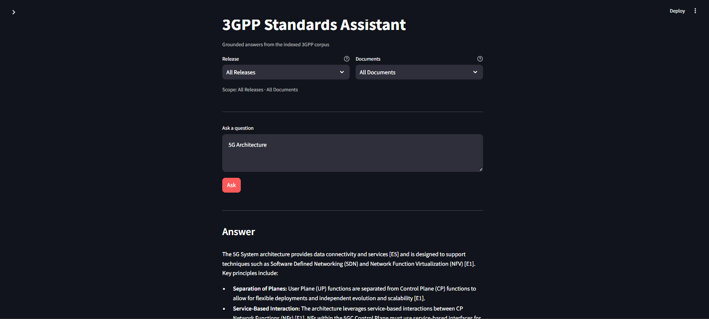
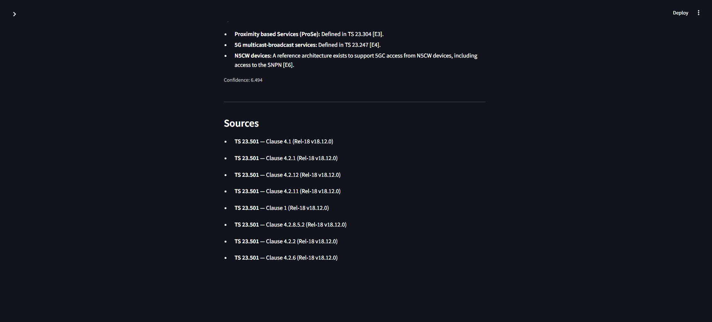
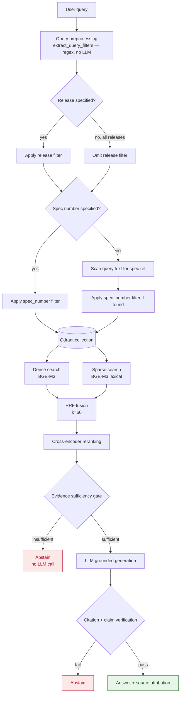
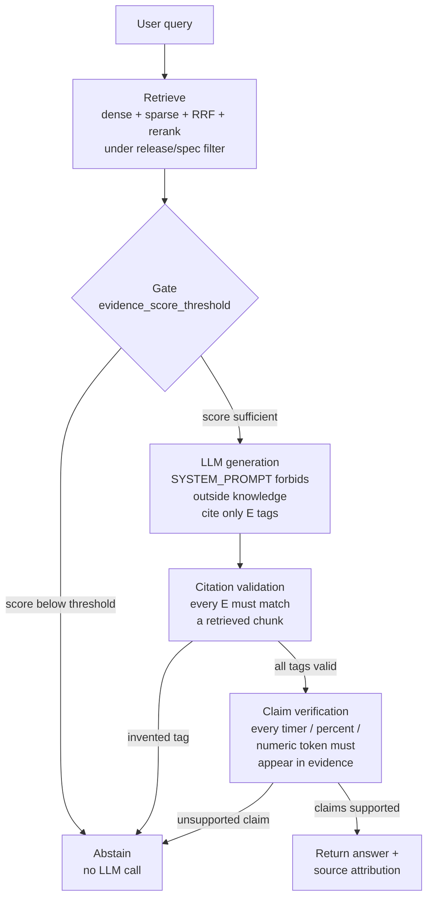

# 3GPP Standards Assistant

A release-aware, clause-aware RAG system for 3GPP technical specifications. It
ingests 3GPP standards documents, preserves their native document structure
(clauses, tables, procedures, ASN.1, annexes), and answers natural-language
questions by retrieving grounded evidence from a vector store rather than
relying on the language model's parametric memory.

**The indexed corpus — not the LLM — is the source of truth.** When the
corpus does not contain sufficient explicit evidence, the system abstains with
a clear explanation rather than producing a plausible-sounding guess.

---

## Key Features

- **Multi-release retrieval** — query a specific release, a specific
  specification, or search across all indexed releases.
- **Specification-aware retrieval** — automatically detects spec numbers such
  as `24.501` and scopes retrieval to that document when detected.
- **Clause-aware chunking** — preserves clause hierarchy, procedures, tables,
  ASN.1 blocks, annexes, and footnotes.
- **Hybrid retrieval** — BGE-M3 dense + sparse search fused via RRF.
- **Cross-encoder reranking** — improves precision over the fused candidate set.
- **Evidence gating** — prevents LLM generation when retrieval evidence is
  insufficient (pre-generation abstention).
- **Grounded generation** — answers must cite retrieved evidence using
  `[E<n>]` tags.
- **Post-generation verification** — validates citations and flags unsupported
  numeric/technical identifiers.
- **Release isolation** — a query scoped to a specific release never retrieves
  content from another release.
- **Deterministic ingestion** — content hashing and UUID5 IDs make ingestion
  idempotent.
- **Safe archive extraction** — protects against ZIP-slip paths.
- **Evaluation harness** — retrieval, generation, and RAGAS metrics.

---

## Supported Release Modes

> All *enabled* releases in `configs/corpus.yaml` are first-class indexed
> corpora (Rel-18 is the configured default, **not** a hard limit on what the
> system can query).

```text
Supports release-aware retrieval across 3GPP releases.
Users can:
• Query a specific release
• Query a specific specification
• Search across all indexed releases
• Prevent cross-release contamination through metadata filtering
```

The release scope can be:

- **Explicit release** — e.g., *"What changed in Rel-18?"*
- **Explicit specification** — e.g., *"What is T3510 in TS 24.501?"*
- **All indexed releases** — e.g., *"How does registration differ across
  Rel-17 and Rel-18?"*

Release filtering is applied at the Qdrant metadata layer **before** vector
retrieval. When "all releases" mode is selected, the release constraint is
intentionally omitted, allowing retrieval across the indexed corpus while
preserving release metadata in every result and citation.

---

## Quick Start

### 1. Clone and install

```bash
git clone <this-repository>
cd 3GPP-Standards-Assistant

python -m venv .venv
source .venv/bin/activate        # Windows: .venv\Scripts\activate

pip install -r requirements.txt
```

`requirements.txt` includes torch-based packages (`FlagEmbedding` for BGE-M3,
`sentence-transformers` for the reranker). These are large installs; if you
only want to run parsing/pipeline validation without embeddings, you can
install the lighter subset first.

### 2. Configure environment

```bash
cp .env.example .env
```

Edit `.env` and set at minimum `GEMINI_API_KEY` before running the chat
pipeline. Key variables:

| Variable | Default | Purpose |
|---|---|---|
| `GEMINI_API_KEY` | — | LLM provider key (never commit a real value) |
| `QDRANT_URL` | `http://localhost:6333` | Qdrant endpoint (local or Cloud) |
| `QDRANT_API_KEY` | — | Qdrant API key (empty for local) |
| `QDRANT_COLLECTION` | `3gpp_standards` | Vector collection name |
| `EMBEDDING_MODEL` | `BAAI/bge-m3` | Dense + sparse embedding model |
| `RERANKER_MODEL` | `cross-encoder/ms-marco-MiniLM-L-6-v2` | Re-ranking cross-encoder |
| `EMBEDDING_BATCH_SIZE` | `16` | Chunks per embedding forward pass |
| `TARGET_RELEASE` | `Rel-18` | Default release for queries (per-query override supported) |
| `DENSE_TOP_K` | `20` | Dense retrieval candidate count |
| `SPARSE_TOP_K` | `20` | Sparse retrieval candidate count |
| `RERANK_TOP_K` | `8` | Final candidate count after re-ranking |
| `EVIDENCE_SCORE_THRESHOLD` | `0.35` | Evidence gate cutoff (calibrate before production) |

### 3. Start Qdrant

```bash
docker run -p 6333:6333 -p 6334:6334 \
  -v qdrant_data:/qdrant/storage \
  qdrant/qdrant:v1.12.4
```

### 4. Discover available specifications

```bash
python scripts/discover_corpus.py --missing                  # defaults to default_release (Rel-18)
python scripts/discover_corpus.py --missing --release Rel-17
```

This inspects the official 3GPP directory and reports which approved specs
are not yet in the allowlist. **Read-only** — never downloads or indexes.

### 5. Download and process the corpus

```bash
# Full pipeline for every allowlisted spec across all *enabled* releases:
python scripts/download.py --all

# Single spec (defaults to TARGET_RELEASE from .env, e.g. Rel-18):
python scripts/download.py 23.501

# Single spec in an explicit release:
python scripts/download.py 23.501 --release Rel-17

# Parse a locally-downloaded DOCX (no network); --release defaults to
# TARGET_RELEASE and controls the output namespace:
python scripts/preprocess.py path/to/24501-i90.docx \
  --spec 24.501 --series 24 --version 18.9.0 \
  --title "Non-Access-Stratum (NAS) protocol for 5G System (5GS)"

# Validate the JSONL corpus and print stats:
python scripts/build_jsonl.py
```

### 6. Ingest into Qdrant

```bash
python scripts/ingest_qdrant.py                          # ingest all processed JSONL (all releases)
python scripts/ingest_qdrant.py --spec 23.501            # one spec across every release it was processed for
python scripts/ingest_qdrant.py --spec 23.501 --release Rel-18  # one spec in one release
```

BGE-M3 model weights are downloaded from HuggingFace Hub on first run
(requires network access). Compute is auto-selected: **CUDA GPU** when
available, otherwise **CPU**.

### 7. Start the API

```bash
uvicorn app.main:app --host 0.0.0.0 --port 8000
```

### 8. Start the UI

In another terminal:

```bash
API_BASE_URL=http://localhost:8000 \
streamlit run frontend/streamlit_app.py
```

Open: http://localhost:8501

---

## Screenshots

### Chat Interface



### Search Results with Evidence



---

## Example Queries

| Query | Retrieval scope |
|---|---|
| `What is T3510?` | All indexed releases |
| `What is T3510 in TS 24.501?` | TS 24.501 |
| `What is T3510 in Rel-18?` | Release 18 (all specs) |
| `What is T3510 in Rel-17?` | Release 17 (all specs) |
| `Compare registration procedures in Rel-17 and Rel-18` | Cross-release |
| `What does clause 5.5.1 specify in TS 24.501?` | TS 24.501, clause 5.5.1 |
| `What is the role of AMF in 5GS?` | Relevant indexed corpus |

The UI's **Release** dropdown supports an "All Releases" option that searches
across every indexed release simultaneously. When a specific release is
selected, retrieval is strictly scoped to that release — a Rel-18 query will
**never** retrieve Rel-17 content.

> Release scope is chosen via the API `release` field or the UI dropdown. The
> query parser extracts **specification numbers** (e.g. `24.501`) automatically,
> but release identifiers must be supplied explicitly — they are not parsed from
> free text.

---

## Example

**Question**

> What is timer T3510 used for in 5G registration?

**Answer**

> T3510 is used during the registration procedure to supervise the expected
> response from the UE. [E1]

**Sources**

```text
[E1] 3GPP TS 24.501
     Clause 5.5.1
     Non-Access-Stratum (NAS) protocol for 5G System (5GS)
     Release 18
```

**Question**

> What chipset does 3GPP recommend for implementing AMF?

**Response**

> I don't have sufficient evidence in the indexed 3GPP corpus to answer this
> question.

---

## Architecture

### Runtime data flow



### Ingestion data flow

```text
3GPP archive (24501-i90.zip)
  │
  ├─ Version + SHA256 validation against allowlist
  ├─ Safe extract (zip-slip protected)
  ├─ DOCX parse (OpenXML, order-preserving)
  ├─ Structure extraction (clauses, tables, ASN.1, annexes)
  ├─ Hierarchical clause-aware chunking
  ├─ Attach metadata (clause, spec, release, content_hash)
  ├─ BGE-M3 dense + sparse embeddings
  ├─ Upsert into Qdrant (deterministic UUID5 IDs)
  └─ JSONL output (data/processed/)
```

### Component map

| Layer | Module | Responsibility |
|---|---|---|
| Query parsing | `app/retrieval/query_preprocessor.py` | Regex-based spec-number extraction (no LLM) |
| Retrieval orchestration | `app/retrieval/retriever.py` | Release/spec filter → dense+sparse → RRF → rerank |
| Dense search | `app/retrieval/dense.py` | Qdrant dense vector query under filter |
| Sparse search | `app/retrieval/sparse.py` | Qdrant sparse vector query under filter |
| Fusion | `app/retrieval/hybrid.py` | RRF fusion + metadata filter builder (release-optional) |
| Reranking | `app/retrieval/reranker.py` | Cross-encoder re-scoring of fused candidates |
| Vector store | `app/retrieval/qdrant_store.py` | Collection lifecycle, payload indexing, upsert |
| Evidence gating | `app/generation/evidence_gate.py` | Score-threshold sufficiency check (pre-generation) |
| Generation | `app/generation/generator.py` | Orchestrates gate → LLM → verification |
| Prompts | `app/generation/prompts.py` | Grounded system prompt, abstention message |
| LLM | `app/generation/llm.py` | Gemini provider + FakeLLMProvider (test double) |
| Citations | `app/citations/generator.py` | `[E<n>]` tag → full citation string |
| Citation validation | `app/citations/validator.py` | Rejects answers with invented citation tags |
| Claim verification | `app/generation/verifier.py` | Flags unsupported numeric/timer identifiers |
| API | `app/api/routes_chat.py` | `POST /chat` — retrieval + grounded generation |
| API | `app/api/routes_search.py` | `POST /search` — transparent retrieval debugging |
| API | `app/api/routes_metadata.py` | `GET /metadata/documents` — corpus allowlist |
| API | `app/api/routes_health.py` | `GET /health` — liveness check |
| Configuration | `app/config.py` | `.env` + YAML settings, release-consistency guard |
| Dependency wiring | `app/dependencies.py` | Singleton providers via FastAPI `Depends` |

---

## Why This Is Different from a Typical PDF Chatbot

| Typical PDF RAG | 3GPP Standards Assistant |
|---|---|
| Treats PDF as flat text | Preserves clause/document hierarchy |
| One embedding search | Dense + sparse hybrid retrieval |
| No release awareness | Release-aware filtering (specific release or all) |
| LLM decides whether evidence exists | Pre-generation evidence gate |
| Trusts generated citations | Citation validation — rejects invented tags |
| Can invent technical values | Deterministic claim verification |
| Generic chunking | Clause/table/ASN.1-aware chunking |
| Manual document inventory | Controlled corpus discovery + allowlist |
| Stateless ingestion | Hash-based / idempotent ingestion |

---

## Release Selection

```text
                    Query
                      │
              Query preprocessing
                      │
          ┌───────────┴───────────┐
          │                       │
   Release specified      No release specified
   (e.g. Rel-18)            (all releases)
          │                       │
          ▼                       ▼
   Filter by release       Search all indexed
          │                    releases
          └───────────┬───────────┘
                      ▼
              Qdrant (payload filter)
```

Release metadata remains attached to every retrieved chunk, allowing the
answer and citations to identify which release each piece of evidence belongs
to.

---

## Tech Stack

```text
Backend       FastAPI · Python · Pydantic
Retrieval     Qdrant · BGE-M3 · RRF
Reranking     Cross-Encoder / Sentence Transformers
LLM           Google Gemini
Ingestion     python-docx · OpenXML · LibreOffice (DOC fallback)
Frontend      Streamlit
Infrastructure Docker · Qdrant
Testing       Pytest · In-memory Qdrant (test doubles)
Evaluation    RAGAS · Custom benchmark dataset
```

---

## Query / Retrieval Behavior

Query preprocessing is intentionally rule-based (regex), not an LLM call. It
must be fast, deterministic, and dependency-free so it runs on every `/chat`
and `/search` request without latency or cost.

The pattern `\b(?:TS\s*?)?(\d{2}\.\d{2,3})\b(?!\.\d)` extracts 3GPP spec
numbers such as `24.501`, `23.502`, or `38.331` from free-text queries (e.g.,
"What is timer T3510 in TS 24.501?").

| Signal | Handling |
|---|---|
| `TS 24.501`, `TS24.501`, `3GPP TS 24.501` | Prefix is optional; core number extracted |
| `18.9.0` (release.version) | Excluded by negative lookahead `(?!\.\d)` (three dot-groups) |
| `5.5.1` (clause number) | Excluded by leading `\d{2}` requirement (single digit) |

The extracted `spec_number`, when present, is passed to the retriever and
applied as a Qdrant payload filter **before** the vector search — this scopes
retrieval to the specific document the user is asking about, dramatically
improving precision over searching the whole corpus.

The `release` filter is applied at the Qdrant metadata layer before vector
retrieval. When a specific release is selected, content outside that release is
structurally excluded. When "all releases" is selected, the release constraint
is intentionally omitted, allowing retrieval across the indexed corpus while
preserving release metadata in every result.

---

## Release and Specification Isolation

The single most safety-critical design constraint is that **a query scoped to
a specific release must never retrieve content from another release**, and a
query about `24.501` must never retrieve `23.501` chunks. This is enforced at
**three** levels:

1. **Configuration guard** — `app/config.py` raises `ValueError` at startup if
   (a) `configs/corpus.yaml` uses the legacy single-release schema (top-level
   `release`/`documents` instead of the `releases:` map), or (b) the env-level
   `TARGET_RELEASE` is not one of the `enabled: true` releases. This ensures
   every release addressed by the pipeline — including the default release used
   by unscoped CLI commands — is explicit and enabled. Cross-release
   contamination is rejected before the process starts.
2. **Qdrant payload filter** — `build_release_spec_filter()` applies a
   `release` match-condition to every query when a release is specified. The
   optional `spec_number` condition is added on top. This filter is applied
   *before* vector search, so neither dense nor sparse vectors consider
   out-of-scope points. When `release=None` (all-releases mode), the release
   condition is omitted but `spec_number` filtering still works.
3. **Test coverage** — `tests/test_retrieval.py` verifies that spec-number
   filtering isolates to the correct document, that release filtering never
   leaks cross-release content, and that all-releases mode retrieves content
   from every indexed release.

---

## Corpus Management

The system ingests only what `configs/corpus.yaml` authorizes. This file is a
**multi-release allowlist**: it carries an independent `documents` allowlist per
release under `releases:` (e.g. `Rel-17`, `Rel-18`), plus a top-level
`default_release`. It is not a manually-populated inventory of every 3GPP
document that exists. Instead, it is generated and validated by
`scripts/discover_corpus.py`, which queries the official 3GPP repository
directory and cross-checks candidates against the allowlist for a given release.

### Discover new specifications

```bash
python scripts/discover_corpus.py --missing
python scripts/discover_corpus.py --missing --release Rel-17
```

Reports specifications found in the official 3GPP directory but not yet in the
allowlist for the requested release. **Read-only** — never downloads, fetches,
or indexes. Omit `--release` (defaults to `default_release`).

### Approve a specification

```bash
python scripts/discover_corpus.py \
  --add "24.502=Non-Access-Stratum (NAS) protocol for 5G System (5GS)"
```

The title is supplied **inline** (`SPEC=TITLE`); there is no separate `--title`
flag. The title must be the official 3GPP title — it is never invented. Requires
verification against the discovered set: the spec number must already appear in a
`--missing` run for the target release (i.e. it must exist in the official
directory for that release). `--add` inserts into the `extended` allowlist of
that release only (`--release` selects it; defaults to `default_release`). All
existing entries, structure, and comments in `corpus.yaml` are preserved; the
same spec added twice is a no-op.

### Approve via the GUI (non-technical users)

For users who prefer a form over the command line, a Streamlit management UI
performs the same discover → select → title → approve flow and writes through the
identical validated writer:

```bash
streamlit run frontend/corpus_manager.py
```

The UI lets the user:
- **select a release** (only enabled releases are offered; release isolation is
  enforced at the archive filename-letter level, e.g. Rel-17 `'h'`, Rel-18 `'i'`),
- click **Discover official specs** to fetch the 3GPP directory for that release
  (cached for 5 minutes) and compare it with the approved allowlist,
- **check** the specs they want to approve (already-approved specs are read-only),
- **enter each spec's official title manually** in the `title` column, and click
  **Approve**, which appends the entries to `releases.<release>.documents.extended`
  in `configs/corpus.yaml` via `add_to_corpus_yaml` (comment-preserving, idempotent,
  rejects blank/placeholder titles).

Titles are never invented: a selection cannot be approved until every checked spec
has a non-empty title. After approving, re-run
`python scripts/download.py --release <R> --missing` (or `--all`) to ingest the
newly allowlisted documents.

### Download approved corpus

```bash
python scripts/download.py --all
```

Runs the full pipeline (download → validate → extract → parse → chunk → JSONL)
for every allowlisted document across **all enabled releases** (each release's
allowlist is processed independently; see `releases:` in `configs/corpus.yaml`).
To scope to one release/spec, pass its arguments instead of `--all`
(e.g. `python scripts/download.py 23.501 --release Rel-18`).

### Corpus validation

```bash
python scripts/build_jsonl.py
```

Validates every `data/processed/*.jsonl` file by re-parsing through the `Chunk`
pydantic model; reports corpus stats.

### Discovery mechanism

`discover_corpus.py` queries the official 3GPP series directories for a release
(`configs/corpus.yaml`'s `releases.<release>.sources.repository_root`), parses
archive filenames (which encode spec number and version using a base-36
release-letter scheme), groups them by series and spec, and selects the
highest-versioned archive per spec. It then compares the discovered set against
the `documents` entries already approved in `corpus.yaml` for that release.
The release-isolation guarantee is enforced at the filename level: only archives
whose release-letter code matches the requested release are considered (Rel-17
uses 'h', Rel-18 uses 'i', …), so archives never mix across releases.

`discover_specs(release)` scopes to one release; `discover_all()` browses every
*enabled* release and is what a browse-all UI calls.

This separation ensures the allowlist remains the **sole source of truth** for
what the downloader and ingestion pipeline may process. Discovery validates the
requested release against `corpus.yaml` (it must be an *enabled* release) and
only considers archives whose release-letter code matches.

---

## Ingestion Pipeline

| Script | Purpose |
|---|---|
| `scripts/download.py` | Full pipeline for one or more specs (download → validate → extract → parse → chunk → JSONL). `--all` processes every allowlisted document across all **enabled releases**; `--release <R> <spec>` or `<spec>` (with `--release`) scopes to one. |
| `scripts/preprocess.py` | Parse an already-present local DOCX into JSONL (useful for testing the parser against real samples without network). |
| `scripts/build_jsonl.py` | Validate every `data/processed/*.jsonl` file by re-parsing through the `Chunk` pydantic model; reports corpus stats. |
| `scripts/ingest_qdrant.py` | Embed all processed JSONL files with BGE-M3 and upsert into Qdrant. |
| `scripts/discover_corpus.py` | Inspect the 3GPP directory for new/approved specs, per release. Read-only: never downloads or indexes. `--add` promotes verified candidates into `releases.<release>.documents.extended`; `--missing` lists un-approved specs; `discover_all()` (programmatic) browses every enabled release from a UI. |

### Pipeline stages

| Stage | Module | Description |
|---|---|---|
| **Directory listing** | `ingestion/downloader.py` | Fetches the 3GPP series directory HTML and parses archive filenames. Retries on transient network errors. |
| **Archive resolution** | `ingestion/downloader.py` | `find_latest_archive` selects the highest-versioned archive matching the spec + release letter. Never falls back across releases. |
| **Download** | `ingestion/downloader.py` | Streams the archive to a `.part` file, renames on success. Atomic against partial downloads. |
| **Validation** | `ingestion/validator.py` | Single choke point: checks spec digits, release letter, file existence, and computes SHA-256. Mismatch = hard stop (never "index with warning"). |
| **Extraction** | `ingestion/archive.py` | `safe_extract` rejects any ZIP entry whose path escapes the destination (zip-slip defense). |
| **DOCX parsing** | `ingestion/docx_parser.py` | Walks OpenXML body directly to preserve true paragraph/table interleaving order (python-docx's `.paragraphs`/`.tables` lose order). Extracts table merge geometry (`gridSpan`, `vMerge`). |
| **DOC→DOCX** (if needed) | `ingestion/doc_converter.py` | Headless LibreOffice conversion for legacy `.doc` archives (some specs ship .doc). |
| **Structure extraction** | `ingestion/structure_parser.py` | Detects clause headings (style + numbering + regex cross-validated), annexes, procedures, notes, figures, and tables. Groups consecutive ASN.1 paragraphs into atomic blocks. |
| **ASN.1 detection** | `ingestion/asn1_parser.py` | Style-based ("TT"/code) + lexical signal (`::=`, `SEQUENCE`, `CHOICE`, etc.). |
| **Table normalization** | `ingestion/table_parser.py` | Resolves merged cells: vertical merges are filled forward (inherited text), horizontal spans preserved via `colspan`. Renders as GitHub-flavored Markdown. |
| **Chunking** | `ingestion/chunker.py` | Clause-aware greedy packing (target 800 tokens max, 80-token overlap). Tables and ASN.1 are isolated as atomic chunks. Multi-block clauses get a synthetic PARENT chunk. |
| **Embedding** | `app/retrieval/embeddings.py` | BGE-M3 produces dense (1024-dim) + sparse vectors in one pass. |
| **Upsert** | `app/retrieval/qdrant_store.py` | Embeds, assigns deterministic UUID5 point IDs (idempotent), skips unchanged chunks (content-hash check), upserts with both vectors + full payload. |

### Chunk model

Each chunk (`app/models/schema.py`) carries the metadata needed for filtering,
citations, and provenance:

- **Identity**: `chunk_id` (globally unique), `content_hash` (`sha256:` of text)
- **Document identity**: `spec_number`, `document_type`, `series`, `release`,
  `release_number`, `version`, `title`
- **Structural location**: `clause_number`, `clause_title`, `clause_path` (full
  ancestry root-first), `parent_clause`, `parent_title`, `parent_chunk_id`
  (for child chunks referencing a synthetic PARENT block)
- **Content**: `content_type` (paragraph, heading, procedure, table, asn1,
  figure, annex, note), `text`, `table_data` (structured, for TABLE chunks),
  `token_count`, `chunk_index`
- **Flags**: `is_normative`, `is_annex`, `is_table`, `is_figure`, `is_asn1`
  (indexed as Qdrant payload fields for fast filtering)
- **Provenance**: `source_file`, `source_url`, `source_locator` (human-readable
  citation string)

---

## Retrieval Design

### Hybrid search

A single retrieval signal is insufficient for 3GPP content:

- **Dense embeddings** capture semantic intent (e.g., "how does UE
  registration work?") but can blur exact identifiers and conflate
  specifications that share terminology (e.g., NAS `T3510` in 24.501 vs. a
  similarly-named timer in another spec).
- **Sparse (lexical) retrieval** matches exact identifiers, version strings,
  and message names verbatim — but misses semantically-related paraphrases.

BGE-M3 produces both representations from a single model in one forward pass,
avoiding dual-model embedding inconsistency.

### RRF fusion

`reciprocal_rank_fusion()` in `app/retrieval/hybrid.py` combines the dense and
sparse result lists using Reciprocal Rank Fusion with the conventional `k=60`
constant. RRF is rank-based and inherently robust to the different score scales
of dense vs. sparse retrieval. It also handles cases where a chunk is missing
from one list's top-k.

RRF is implemented in Python rather than relying on Qdrant's server-side
fusion API, keeping behavior stable across Qdrant versions and trivially
unit-testable.

### Reranking

The `cross-encoder/ms-marco-MiniLM-L-6-v2` cross-encoder re-scores the small
candidate set (8 chunks by default) with full query×chunk attention after
fusion. This trades recall for precision on the candidate set at low cost,
since the candidate width is already constrained.

---

## Hallucination Mitigation

The system applies a four-stage grounding pipeline. The ordering matters —
each layer filters out a different failure class before the next expensive
step.



**Stage 1 — Metadata filtering (before retrieval):** The Qdrant payload filter
on `release` and `spec_number` ensures retrieval only considers points from the
scoped specification and release. When no release is specified (all-releases
mode), the release condition is omitted but the spec_number filter still
applies. Out-of-scope content is structurally excluded.

**Stage 2 — Evidence sufficiency gate (before generation):** If the top
retrieval score is below `EVIDENCE_SCORE_THRESHOLD` (default `0.35`), the LLM is
never called. The gate is a pre-generation check — it answers "is there enough
evidence?" without attempting to answer the question itself. An optional
LLM-based secondary sufficiency check (`llm_sufficiency_check`) is provided for
cases where a score threshold alone is too blunt.

**Stage 3 — Grounded generation prompt:** The `SYSTEM_PROMPT` (in
`app/generation/prompts.py`) explicitly forbids outside knowledge, model
memory, assumptions, unstated implications, and unsupported technical
inference. It instructs the model to cite every claim using the bracketed
`[E<n>]` tags provided in the evidence block, and to respond with the exact
abstention message when evidence is insufficient. Temperature is set to `0.1`
(low) in the Gemini provider to minimize stochastic drift.

**Stage 4 — Post-generation verification:** After the LLM produces an answer:

- **Citation validation** (`app/citations/validator.py`): Every `[E<n>]` tag in
  the answer is checked against the list of actually-retrieved citations. Any
  tag numbering a chunk that was not supplied is treated as an invented
  reference — the answer is rejected and replaced with abstention.
- **Claim verification** (`app/generation/verifier.py`): Numeric tokens (timers
  like `T3510`, percentages, and 2+ digit bare numbers) in the answer that do
  not appear verbatim in the retrieved evidence text are flagged as unsupported
  invention. The answer is rejected if any are found. (Single-digit numbers
  like "5G" are excluded to avoid false positives.)

**Abstention** is treated as a normal, successful outcome at every stage — not
an error path. When the pipeline cannot ground an answer in retrieved evidence,
it returns a clean abstention message with the specific reason, and the UI
surfaces that reason to the user.

---

## API Endpoints

| Method | Endpoint | Description |
|---|---|---|
| `POST` | `/chat` | Retrieve + generate a grounded answer (the main entry point) |
| `POST` | `/search` | Transparent retrieval debugging (bypasses evidence gate + LLM) |
| `GET` | `/metadata/documents` | List the corpus allowlist for the frontend's document selector |
| `GET` | `/health` | Liveness check (Qdrant reachable + collection exists) |

### `POST /chat` request body

| Field | Type | Default | Description |
|---|---|---|---|
| `query` | string | required | Natural-language question |
| `release` | string or null | `"Rel-18"` | Specific release to query, or `null` for all releases |
| `spec_number` | string or null | null | Optional spec number to scope retrieval (e.g., `"24.501"`) |

### `POST /chat` response

| Field | Type | Description |
|---|---|---|
| `answer` | string | The grounded answer (or abstention message) |
| `abstained` | boolean | Whether the system abstained |
| `confidence` | float | Minimum retrieval score among cited sources |
| `sources` | array | List of source documents with spec, release, version, clause |
| `abstain_reason` | string | Reason for abstention (when applicable) |

---

## Evaluation

The repository includes evaluation harnesses that measure both retrieval quality
and generation safety. These scripts require a populated Qdrant collection and
network access to the 3GPP repository, HuggingFace, and the Gemini API.

### Benchmark dataset

`evaluation/dataset.json` contains **22 curated questions** organized by
category:

| Category | Count | Description |
|---|---|---|
| Architecture | 3 | System-level "what is the role of X" questions |
| Procedures | 2 | Multi-step procedure descriptions |
| NAS | 2 | Spec-specific identifier questions (e.g., T3510) |
| RAN | 2 | 38.331 RRC message content |
| Security | 2 | 33.501 authentication and key hierarchy |
| Exact identifier | 2 | Precise values/timers |
| Tables | 2 | Table-derived content (5QI values, 5GMM cause values) |
| Cross-document | 2 | Relations across specs |
| Unanswerable | 3 | Out-of-scope (internal budget, author names, silicon specs) |
| Wrong release | 2 | Rel-17 or Rel-15 questions against a Rel-18 corpus |

Every question carries an `answerable` boolean and, for answerable questions, an
`expected_spec` and optional `expected_clause_prefix`.

### Evaluation scripts

| Script | Metrics | Description |
|---|---|---|
| `evaluation/evaluate_retrieval.py` | `recall_at_5/10/20`, `context_precision_at_5` | Runs each answerable question through the retriever directly (bypassing LLM); checks whether a retrieved chunk matches the `expected_spec` (and clause prefix). |
| `evaluation/evaluate_generation.py` | `correct_abstentions`, `false_answer_rate`, `unnecessary_abstention_rate`, `citation_accuracy`, `hallucination_rate` | Runs the full grounded-generation pipeline for every question; scores outcomes against `answerable` labels. |
| `evaluation/ragas_eval.py` | `faithfulness`, `context_precision`, `context_recall` | LLM-judge metrics via ragas + Gemini. Reference answers are generated by a separate Gemini judge and cached. `--fake` mode dumps the assembled dataset without network. |

### Running evaluation

```bash
python evaluation/evaluate_retrieval.py    # recall@k, context precision
python evaluation/evaluate_generation.py   # citation accuracy, abstention rates
python evaluation/ragas_eval.py --fake     # assemble ragas dataset (no network)
python evaluation/ragas_eval.py           # real Gemini judge (requires GEMINI_API_KEY)
```

**Important caveat:** The evaluation harnesses are implemented and importable,
but have **not** been run against a live corpus in this environment. Measuring
real retrieval/generation metrics requires outbound access to the 3GPP
repository, HuggingFace (for BGE-M3 weights), and the Gemini API. No numerical
metric values are reported until a live run is performed. The
`EVIDENCE_SCORE_THRESHOLD` (default `0.35`) is a starting value that must be
calibrated against real data.

---

## Testing

The test suite (`tests/`) uses synthetic fixtures and test doubles
(`FakeEmbeddingProvider`, `FakeReranker`, `FakeLLMProvider`) with an in-memory
Qdrant instance — no real models or network access required.

| Test file | Test | What it verifies |
|---|---|---|
| `tests/test_query_preprocessor.py` | `test_extracts_spec_number_from_query` | `extract_query_filters("What is timer T3510 in TS 24.501?")` returns `spec_number="24.501"` |
| `tests/test_retrieval.py` | `test_metadata_filter_isolates_spec_number` | Qdrant payload filter scopes dense retrieval to one spec number |
| `tests/test_retrieval.py` | `test_retriever_release_never_overridden_by_query` | A query naming a spec does not leak content from another release |
| `tests/test_retrieval.py` | `test_retriever_all_releases_mode` | `release=None` retrieves content from all indexed releases |
| `tests/test_retrieval.py` | `test_build_release_spec_filter_omits_release_when_none` | `build_release_spec_filter(None)` produces no release condition |
| `tests/test_generator.py` | `test_abstains_when_evidence_gate_fails` | Below-threshold evidence causes the generator to abstain without calling the LLM |
| `tests/test_api.py` | `test_chat_endpoint_returns_grounded_answer` | End-to-end `/chat`: retrieval → evidence gate → LLM → citations → source attribution |

Run the suite:

```bash
python -m pytest tests/ -v
```

---

## Limitations

- **No live evaluation on real 3GPP data.** BGE-M3 weights, the Gemini API,
  and the 3GPP repository are not reachable from this development environment.
  Retrieval/generation metrics and the `EVIDENCE_SCORE_THRESHOLD` have not been
  calibrated against real documents. The test suite uses synthetic fixtures and
  fake providers.
- **Corpus scope is release-driven.** `configs/corpus.yaml` carries an
  allowlist per *enabled* release (Rel-17 and Rel-18 by default). Each release
  is indexed independently under its own release namespace; queries scope to a
  specific release or to all enabled releases via the `release` API field / UI
  dropdown. The retrieval layer is release-agnostic — the `release` query
  parameter is a first-class API field that flows through to the Qdrant
  metadata filter.
- **Evaluation dataset size.** `evaluation/dataset.json` has 22 questions;
  100–150 questions are recommended for statistically meaningful thresholds and
  ablation comparisons.
- **Figure handling.** Figures are detected by caption pattern
  (`Figure X.Y: ...`) and flagged, not extracted as image objects. The system
  deliberately avoids answering from unparsed diagrams.
- **ASN.1 detection is heuristic** (paragraph style + lexical signal) and may
  need tuning for unusually formatted real documents.
- **Chunk sizing fallback.** If `tiktoken` cannot fetch its vocabulary (no
  network), the chunker falls back to a character-count approximation for
  sizing only; chunk *content* and all grounding guarantees are unaffected.
- **Cross-document synthesis.** The retriever can search across multiple
  specifications and releases. However, the current generation pipeline is
  optimized for evidence-grounded retrieval rather than complex multi-document
  comparative synthesis.

---

## Project Structure

```text
3GPP Standards Assistant/
├── app/
│   ├── main.py                   # FastAPI app + route wiring
│   ├── dependencies.py           # Singleton wiring (retriever, generator, embedder, reranker, LLM)
│   ├── config.py                 # .env + configs/*.yaml, release-consistency guard
│   ├── logging_config.py         # Structured loguru configuration
│   ├── api/
│   │   ├── routes_chat.py        # POST /chat — retrieval + grounded generation
│   │   ├── routes_search.py      # POST /search — transparent retrieval debugging
│   │   ├── routes_metadata.py    # GET /metadata/documents — corpus allowlist
│   │   ├── routes_health.py      # GET /health — liveness check
│   │   └── schemas.py            # Pydantic request/response models
│   ├── models/
│   │   └── schema.py             # Chunk / TableData / TableCell / SourceDocument models
│   ├── retrieval/
│   │   ├── device.py             # CUDA/CPU auto-selection
│   │   ├── embeddings.py         # BGE-M3 dense + sparse provider
│   │   ├── qdrant_store.py       # Collection lifecycle, payload indexing, upsert
│   │   ├── dense.py              # Dense vector search
│   │   ├── sparse.py             # Sparse vector search
│   │   ├── hybrid.py             # RRF fusion + metadata filter builder (release-optional)
│   │   ├── reranker.py           # Cross-encoder reranker
│   │   ├── query_preprocessor.py # Regex-based spec-number extraction
│   │   └── retriever.py          # Orchestrates filter → dense+sparse → RRF → rerank
│   ├── generation/
│   │   ├── prompts.py            # Grounded system prompt + abstention message
│   │   ├── llm.py                # Gemini LLM provider + fake (test double)
│   │   ├── evidence_gate.py      # Pre-generation evidence sufficiency threshold
│   │   ├── verifier.py           # Post-generation claim verification
│   │   └── generator.py          # Grounded generation orchestrator
│   ├── citations/
│   │   ├── generator.py          # [E<n>] tag → citation mapping
│   │   └── validator.py          # Citation tag validation
├── configs/
│   ├── corpus.yaml               # Multi-release document allowlist (releases: map)
│   └── settings.yaml             # Chunking defaults
├── ingestion/
│   ├── downloader.py             # Resolve + download latest archive (3GPP filename conventions)
│   ├── validator.py              # Filename/version/SHA256/allowlist validation
│   ├── archive.py                # Safe ZIP extraction (zip-slip protected)
│   ├── doc_converter.py          # Legacy DOC → DOCX via LibreOffice
│   ├── docx_parser.py            # OpenXML order-preserving DOCX parser
│   ├── structure_parser.py       # Clause/table/procedure/ASN.1/annex detection
│   ├── table_parser.py           # Merged-cell table normalization
│   ├── asn1_parser.py            # ASN.1 block detection
│   ├── chunker.py                # Hierarchical clause-aware chunking
│   └── pipeline.py               # download → validate → extract → parse → chunk → JSONL
├── scripts/
│   ├── download.py               # Download + ingest one/many/all specs
│   ├── preprocess.py             # Parse a local DOCX into JSONL
│   ├── build_jsonl.py            # Validate JSONL corpus + print stats
│   ├── ingest_qdrant.py          # Embed + upsert into Qdrant
│   └── discover_corpus.py        # Inspect 3GPP directory for new/approved specs
├── evaluation/
│   ├── dataset.json              # 22 benchmark questions
│   ├── evaluate_retrieval.py     # Recall@k, context precision
│   ├── evaluate_generation.py    # Citation accuracy, abstention rates, hallucination proxy
│   ├── ragas_eval.py             # LLM-judge metrics (faithfulness, context precision/recall)
│   └── results/                  # Evaluation output
├── frontend/
│   ├── streamlit_app.py          # Chat UI
│   └── corpus_manager.py         # Corpus allowlist management UI
├── tests/                        # Unit tests (synthetic fixtures, in-memory Qdrant)
├── requirements.txt
└── .env.example
```

---

## License

This project indexes publicly available 3GPP specifications for research and
internal reference. The 3GPP content itself remains the property of 3GPP and
its contributing partners; this tool provides a search and query interface over
that content, not a redistribution of it.